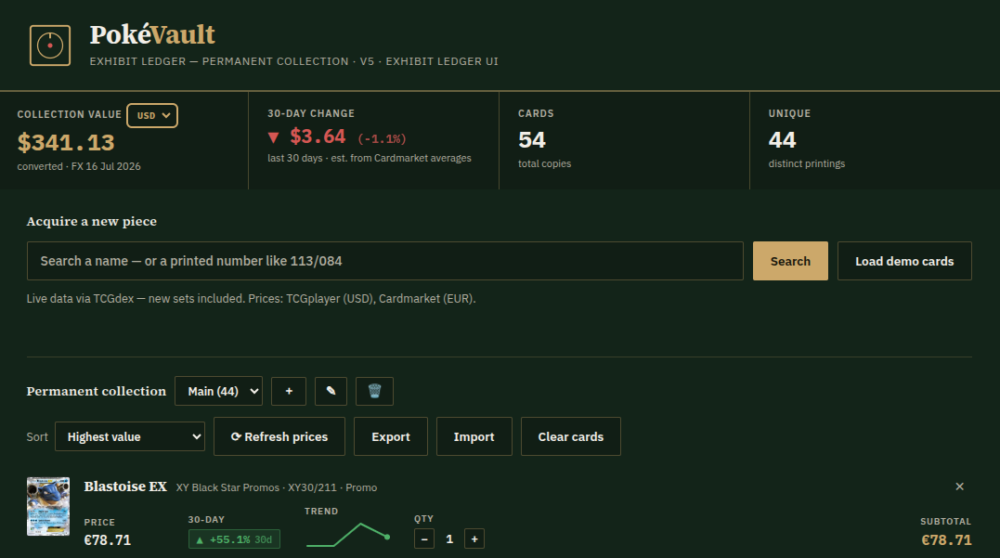

# PokéVault

[](https://arthurfachel.github.io/pokevault/)
[](https://pages.github.com/)
[](LICENSE)
[](#)

A Pokémon TCG collection tracker that runs entirely in the browser: no backend, no build step, no dependencies. Search a card by name or by its printed number, add the printings you own to one or more named collections, and track current market prices, 30-day movement, and total collection value in the currency of your choice.

**Live demo →** https://arthurfachel.github.io/pokevault/



## Features

- **Live card search** via [TCGdex](https://tcgdex.dev) (up to date with new sets, no API key), with [pokemontcg.io](https://pokemontcg.io) as a legacy fallback
- **Search by printed number** (e.g. `113/084` or `TG13/TG30`): matches every set with that printed total so you pick the right one
- **Current market price** per variant (Holofoil, Reverse Holo, …): TCGplayer (USD), falling back to Cardmarket (EUR)
- **30-day price movement** with a ▲/▼ badge and a per-card trend sparkline
- **Multiple named collections** (profiles): create, rename, delete, and switch between them
- **Selectable display currency** for the collection total: native, USD, EUR, BRL, or JPY
- **Local persistence**: collections save automatically in the browser; **Export/Import** produces a portable JSON backup
- **Sorting** by value, biggest 30-day mover, name, or recently added
- **Demo mode** with sample data for offline/sandboxed environments

## How it works

| | |
|---|---|
| **Current price** | TCGplayer market price per variant (USD); falls back to Cardmarket trend (EUR). Both ship embedded in TCGdex card responses. |
| **30-day change** | Estimated from Cardmarket's `avg1` vs `avg30` sale averages (holo-aware), since TCGplayer exposes no price history. |
| **Sparkline** | Plots Cardmarket's `avg30 → avg7 → avg1 → trend` points per card. |
| **Number lookup** | `113/084` → matches sets whose printed total is `84`, then fetches card `113` from each candidate set. |
| **Display currency** | Converts the collection total and 30-day change using daily rates from the ExchangeRate-API open endpoint, with Frankfurter (ECB) as a fallback. |
| **Persistence** | Browser `localStorage` by default; falls back to in-memory storage if unavailable. Export/Import moves data as a plain JSON file. |

## Tech stack

Single self-contained `index.html`: vanilla HTML, CSS, and JavaScript. No framework, no bundler, no package manager. Data comes from [TCGdex](https://tcgdex.dev), [pokemontcg.io](https://pokemontcg.io) (fallback), [ExchangeRate-API](https://www.exchangerate-api.com), and [Frankfurter](https://frankfurter.dev) (fallback).

## Getting started

```bash
git clone https://github.com/ArthurFachel/pokevault.git
cd pokevault
open index.html   # or just double-click it
```

No build step, no install step.

## Deploying your own copy

GitHub → **Settings → Pages** → *Deploy from a branch* → `main`, `/ (root)`.

## Contributing

This started as a personal project, but issues and pull requests are welcome: bug reports, new currencies, additional data sources, or UI polish.

## Disclaimer

Prices are indicative market data, not appraisals. Very recent releases may not have pricing until the marketplaces list them. This project is unaffiliated with Nintendo, The Pokémon Company, TCGdex, TCGplayer, or Cardmarket.

## License

[MIT](LICENSE) © Arthur Domingues Fachel Nunes
